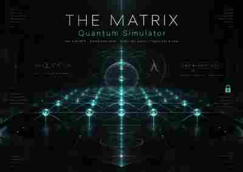

# THE MATRIX Quantum Simulator



[Open MATRIX](https://nicholaskouns-create.github.io/E47-Kartekeya/interfaces/matrix/) · [Machine certificate](../website/data/MC-MATRIX-PARITY-20260921-001.json) · [Python validator](../scripts/validate_matrix_quantum_parity.py)

## Status

**E1 software/numerical quantum-simulation parity: PASS.**

Canonical certificate: `MC-MATRIX-PARITY-20260921-001`.

Certified run: **8 qubits, 24 layers, maximum bond χ = 16, phase φ = 0.7**. The browser MPS worker also passes exact-equivalence smoke tests for untruncated registers `n=2..8`.

| Check | Result |
|---|---:|
| Python MPS ↔ dense phase-aligned relative L2 | `6.9797841682435854e-15` |
| State fidelity | `1.0` |
| Observable maximum error | `4.163336342344337e-15` |
| Schmidt-spectrum maximum error | `1.6653345369377348e-15` |
| Discarded weight | `5.241335934017881e-32` |
| Qiskit Aer phase-aligned relative L2 | `1.5030029036919424e-14` |
| Qiskit Aer fidelity | `1.0000000000000004` |

Independent quantum oracle: **Qiskit 2.5.0 + qiskit-aer 0.17.2**.

## Engine v2

The browser backend is a two-site complex-Float64 Matrix Product State engine running in a Web Worker. Each nearest-neighbor CNOT contracts two site tensors, reshapes the merged tensor into a matrix, performs a stable SVD/Jacobi factorization, truncates to the configured bond dimension χ when needed, and reconstructs the two MPS sites.

The worker also carries:
- an exact dense statevector reference for small registers;
- deterministic seeded amplitude-damping + phase-flip trajectories;
- explicit discarded-Schmidt-weight telemetry;
- materialization of amplitudes for the downstream typed feature lift.

## Representation contract

The simulator intentionally separates three arrows:

1. **MPS ↔ dense / Qiskit Aer** is state-representation parity up to global phase.
2. **256 → 125** is an explicit normalized sampled-amplitude **feature map**, not a Hilbert-space isomorphism.
3. **125 → 128** is an isometric embedding with invalid padding states 125, 126, 127.

## E47 downstream witness

After the typed 125-state lift, the independent Python reconstruction verifies:

- rank P47 = 47
- Ωc = 47/125 = 0.376
- Frobenius residual P47² − P47 = `5.541372953883602e-15`
- Frobenius residual K P47 = `4.996015056480395e-12`
- spec(K²) = `{0, 11664, 12544, 19600, 32400, 186624}`
- spectral gap = `11664`
- maximum K² eigenvalue = `186624`

For the 125 → 128 embedding, both the isometry residual and the R47 intertwiner residual are exactly zero at the reported numerical precision, with zero population in padding states 125..127.

## Scientific boundary

- THE MATRIX is a **software quantum simulator**, not a quantum computer.
- The E1 certificate covers numerical/software parity, not hardware or experimental physics.
- Bond truncation is approximation and must be read together with discarded Schmidt weight.
- The 125-feature lift does not identify qubit Hilbert space with the E47 carrier.
- E47 analysis starts only after the typed lift.
- The E47 witness does not promote downstream E2 simulations into E1 physical claims.

## Reproduce

```bash
node scripts/check_matrix_mps_worker.mjs
python scripts/validate_matrix_quantum_parity.py --require-qiskit
```

The GitHub Actions workflow `.github/workflows/matrix-mps-validation.yml` runs both the browser worker smoke and the independent Python/Qiskit Aer parity gate.

## Pipeline

`circuit → two-site MPS → dense/Aer parity → feature-125 → P47,K → embedding-128 → CITY-125 / AETHERIS`
